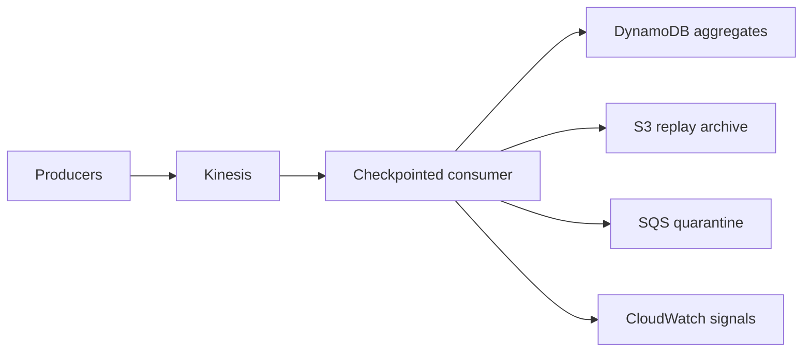

# EventPulse — Real-Time Engagement Platform

[](https://github.com/bhuvaneshwaranmurugan21/eventpulse-realtime-engagement-platform/actions/workflows/ci.yml)

EventPulse is a bounded reference implementation of event-time engagement processing. It makes
late-data policy, duplicate identity, atomic checkpointing, poison-record isolation, and hot-key
pressure explicit rather than hiding them behind a streaming framework.



## Correctness demonstrated locally

- event identity is immutable: an ID reused with a changed payload is rejected;
- duplicates are suppressed before state mutation;
- a watermark and allowed-lateness policy control event-time acceptance;
- a micro-batch and its checkpoint commit atomically or not at all;
- checkpoint restore produces the same state digest;
- poison records are quarantined without poisoning the batch;
- deterministic hash partitioning exposes hot-partition pressure;
- sessions and purchase aggregates are replay-stable.

The Terraform module is a production-shaped, low-cost topology. It is not proof of managed AWS
execution. That claim requires run identifiers, injected failures, CloudWatch evidence, measured
runtime/cost, and teardown proof as described in `docs/claims.yaml`.

```bash
python -m venv .venv
source .venv/bin/activate
python -m pip install -e '.[dev]'
make check
make evidence
```

