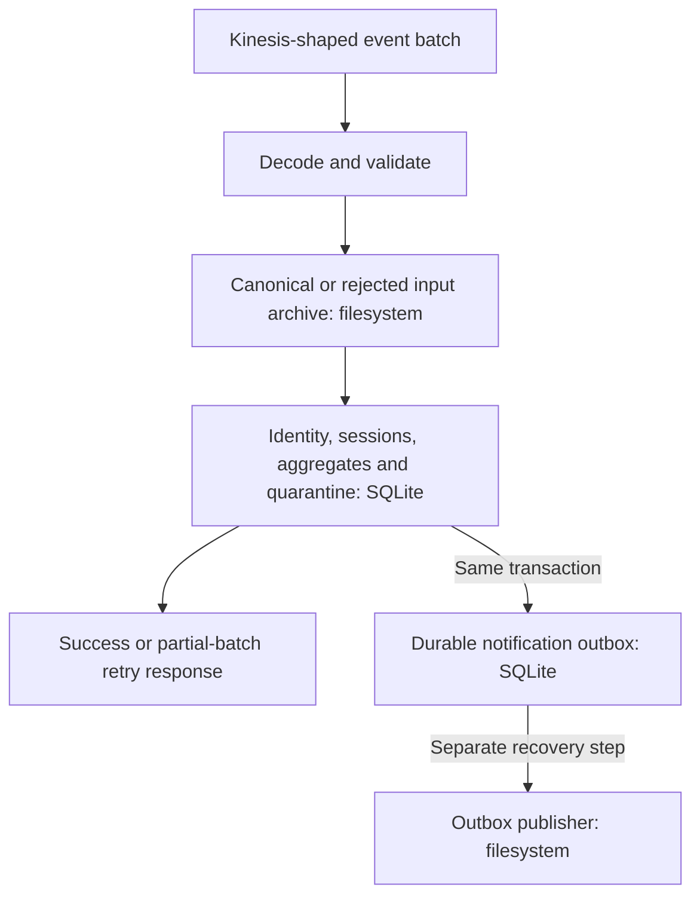

# EventPulse Realtime Engagement Platform

[](https://github.com/bhuvaneshwaranmurugan21/eventpulse-realtime-engagement-platform/actions/workflows/stage3-oracles.yml)  

EventPulse turns user engagement events into deterministic sessions and user aggregates while handling duplicate delivery, out-of-order arrival, invalid input and interrupted processing.

The implemented consumer runs through a shared Lambda/Kinesis-shaped handler with filesystem archives and durable SQLite state. Local verification covers event semantics, partial-batch retries, replay and process-death recovery. AWS adapter request construction is design-tested; managed deployment and service behavior remain work on the roadmap.

[Architecture](#architecture) · [Quick start](#quick-start) · [Verification](#verification) · [Project plan](#project-plan) · [Engineering documents](#engineering-documents)

## What the platform does

| Capability | Implemented behavior |
| --- | --- |
| Contract-based ingestion | Validates versioned engagement envelopes, partition keys, timestamps and allowed payload fields. |
| Deterministic identity | Uses canonical event digests to absorb identical duplicates and quarantine conflicting identities. |
| Event-time sessions | Tracks per-shard watermarks and merges open session components as eligible late events arrive. |
| Durable processing | Archives input before committing identity, session, aggregate and disposition state. |
| Quarantine and notification | Retains invalid or conflicting input with a reason and records notifications in a durable outbox. |
| Partial-batch retries | Returns the earliest retryable failed sequence for each affected shard while allowing other shards to progress. |
| Recovery and replay | Resumes after process death and isolates replay state through generation identifiers. |

The event types are `view`, `click` and `purchase`. The platform produces closed session records and user aggregates; it also retains the archive and quarantine records needed to explain an event's disposition.

## Architecture

### Implemented local path


```mermaid
flowchart TD
    batch["Kinesis-shaped event batch"] --> validation["Decode and validate"]
    validation --> archive["Canonical or rejected input archive: filesystem"]
    archive --> state["Identity, sessions, aggregates and quarantine: SQLite"]
    state --> response["Success or partial-batch retry response"]
    state -->|Same transaction| outbox["Durable notification outbox: SQLite"]
    outbox -->|Separate recovery step| publisher["Outbox publisher: filesystem"]
```

The archive write happens before the state transaction. SQLite commits the event's application state and any required outbox row before the handler acknowledges it. Notification delivery happens later through a separate recovery step, so a notification failure does not erase the durable disposition.

The local adapter uses SQLite WAL mode, full synchronous writes and explicit transactions. Archive and database writes are separate operations; retries and restart recovery reconcile the boundary between them.

### Planned AWS deployment

The cloud architecture maps the same responsibilities to managed services in `ap-south-2`. This is the deployment design, with service execution still to be verified.

| Responsibility | AWS design |
| --- | --- |
| Event transport | Kinesis Data Streams |
| Consumer execution | AWS Lambda with partial-batch failure reporting |
| Input and failure archive | Amazon S3 |
| Identity, session, quarantine and outbox state | DynamoDB transactions and conditional writes |
| Notification and redrive transport | Amazon SQS |
| Logs and operational metrics | Amazon CloudWatch |

See the [architecture authority](docs/architecture.md), [operations contract](docs/operations-contract.md) and [security and lifecycle design](docs/security-and-lifecycle.md) for the cloud boundaries and operating constraints.

## Event contract and correctness rules

The [event schema](contracts/engagement-event-v1.schema.json) fixes the envelope at version `1.0.0`. For example:

```json
{
  "schema_version": "1.0.0",
  "event_id": "evt-0001",
  "source": "web",
  "user_id": "user-0042",
  "event_type": "purchase",
  "event_time_ms": 1791331200000,
  "ingest_time_ms": 1791331201000,
  "partition_key": "user-0042",
  "payload": {
    "page_id": "checkout",
    "campaign_id": "autumn-2026",
    "value_cents": 2499
  }
}
```

Times are UTC Unix epoch milliseconds. `partition_key` must equal `user_id`, and users are identified by pseudonymous IDs. Purchase values use integer cents; `view` and `click` events cannot include `value_cents`. Payloads allow only the schema's named fields, excluding names, contact details, free text and credentials.

| Rule | Contract |
| --- | --- |
| Event digest | SHA-256 of canonical JSON excluding only `ingest_time_ms`; JSON key order does not change identity. |
| Allowed lateness | 30 minutes; each physical shard's watermark is its maximum valid event time minus this window. |
| Session gap | 30 minutes; events exactly one gap apart can belong to the same session. |
| Session closure | A session closes only when the watermark is strictly greater than its end time plus the session gap. |
| Duplicate horizon | Identical duplicates within seven days do not apply the engagement effect again; conflicting identities are quarantined. |
| Expired identity | Events outside the identity horizon are archived and quarantined without changing live engagement state. |
| Retry boundary | Processing stops at the earliest retryable failure within a shard and reports that sequence for retry. |
| Replay isolation | A new generation keeps replay state separate from the live generation. |

Watermarks advance with valid event arrivals. Idle time alone does not finalize sessions. Worked boundary examples are in the [semantic examples](contracts/semantic-examples-v1.json), with recovery ordering in the [recovery protocol](contracts/recovery-protocol-v1.json).

## Quick start

Use **Python 3.12 on Linux or WSL, x86-64**. The checked-in dependency hashes are qualified for this environment. The demo uses local files and SQLite and requires no AWS account or credentials.

```bash
git clone https://github.com/bhuvaneshwaranmurugan21/eventpulse-realtime-engagement-platform.git
cd eventpulse-realtime-engagement-platform

# Keep the virtual environment and generated state outside the checkout.
EP_DEMO_ROOT=$(mktemp -d)
python3.12 -m venv "$EP_DEMO_ROOT/venv"
source "$EP_DEMO_ROOT/venv/bin/activate"
export PYTHONDONTWRITEBYTECODE=1

python -m pip install --require-hashes -r requirements/runtime.lock
python scripts/run_part2_stage1_local.py \
  fixtures/part2/stage1/kinesis-vertical-slice.json \
  "$EP_DEMO_ROOT/ordinary" > "$EP_DEMO_ROOT/handler-result.json"

python -m json.tool "$EP_DEMO_ROOT/handler-result.json"
```

The fixture contains a valid engagement event, a privacy-invalid event and an event that advances the shard watermark. A successful run returns an empty `batchItemFailures` list, retains one quarantine record and produces one closed session.

| Generated artifact | Purpose |
| --- | --- |
| `ordinary/state.sqlite3` | Identity ledger, session state, user aggregates, quarantine and outbox. |
| `ordinary/archive/raw/` | Canonical valid-event archive. |
| `ordinary/archive/rejected/` | Archive for rejected input. |
| `handler-result.json` | Handler response, structured logs, state snapshot and result digest. |

To exercise duplicate delivery, run the same fixture against the same state directory:

```bash
python scripts/run_part2_stage1_local.py \
  fixtures/part2/stage1/kinesis-vertical-slice.json \
  "$EP_DEMO_ROOT/ordinary" > "$EP_DEMO_ROOT/handler-retry.json"
```

The retry preserves the engagement effects. Duplicate telemetry can change, so the complete result JSON is not expected to be byte-identical.

## Verification

The repository includes independent reference oracles, ordinary and failure-path tests, generated semantic checks and a subprocess crash harness.

```bash
# Consumer, durable-state, recovery and adapter tests.
python -m unittest discover -s tests -p 'test_part2_stage*.py'

# Contract and reference-oracle tests.
python -m unittest discover -s tests -p 'test_stage*.py'

# Deterministic generated checks.
python scripts/run_part2_stage3_properties.py

# The output directory must be new; the harness refuses an existing directory.
python scripts/run_part2_stage2_crash_matrix.py \
  --output "$EP_DEMO_ROOT/crash-proof"
```

The local verification includes **56 consumer tests**, **208 generated checks** with a fixed seed, and **eight process-death/restart boundaries**. The crash harness runs the shared consumer entry path, blocks network access in its child processes and records snapshots before and after restart. Its `summary.json` reports the passed boundaries; each case retains its response and recovery journal.

To run the consumer coverage gate with the development dependencies:

```bash
python -m pip install --require-hashes -r requirements/dev.lock
COVERAGE_FILE="$EP_DEMO_ROOT/.coverage" coverage run --branch \
  -m unittest discover -s tests -p 'test_part2_stage*.py'
COVERAGE_FILE="$EP_DEMO_ROOT/.coverage" coverage report --fail-under=85
```

The [local completion record](part2/stage3/docs/audits/completion.md) and [proof matrix](part2/stage3/docs/proof-matrix.json) connect the implementation to the committed verification evidence. These checks establish local behavior; cloud measurements belong to the managed verification stages below.

## Project plan

| Phase | Status | Deliverable |
| --- | --- | --- |
| Event contracts and reference oracles | Complete locally | Versioned schema, semantic examples and independent expected results. |
| Consumer and durable local recovery | Complete locally | Shared handler, filesystem/SQLite adapters, quarantine, retries and restart proof. |
| AWS admission and deployment preparation | In progress | Read-only admission controls are implemented; fresh source, identity, region, quota, budget, backend and lease checks remain required. |
| Minimal managed deployment | Planned | Review an exact infrastructure plan, deploy the bounded service path and verify wiring and telemetry. |
| Managed failure and workload verification | Planned | Reconcile source/archive/output, exercise recovery and replay, and measure performance, cost and teardown. |
| Evidence-backed release | Planned | Close outstanding acceptance criteria and publish results supported by the completed verification. |

The current admission record is `IMPLEMENTED_PENDING_FRESH_OBSERVATION`. The [admission requirements](part3/stage2/admission/requirements.json) and [remaining acceptance criteria](docs/requirements/parts2-5-acceptance.json) define the next steps.

## Current limits

- The verified runtime is the local filesystem/SQLite path. AWS adapters have request-construction tests, with no managed service execution proof yet.
- The managed AWS closure executor is incomplete. Eligible session closure work currently raises a retryable dependency error in that adapter.
- Local notification delivery is at least once through a durable outbox. Transport exactly-once delivery is not a project guarantee.
- Managed throughput, latency, spend and teardown results have not been measured. Local crash recovery does not establish those results.

The [known limits](part2/stage3/docs/known-limits.md) record the current verification boundary.

## Repository map

| Path | Contents |
| --- | --- |
| [`src/eventpulse/`](src/eventpulse/) | Shared handler, canonical identity, event semantics, local/AWS adapters and recovery. |
| [`contracts/`](contracts/) | Event schema, semantic rules, recovery protocol and oracle specifications. |
| [`fixtures/`](fixtures/) | Deterministic valid, invalid, boundary and recovery inputs. |
| [`oracles/`](oracles/) | Independent reference implementations. |
| [`scripts/`](scripts/) | Local demo, crash harness, property checks and evidence validation. |
| [`tests/`](tests/) | Contract, consumer, recovery and admission tests. |
| [`requirements/`](requirements/) | Hash-locked runtime and development dependencies. |
| [`evidence/`](evidence/) | Versioned verification outputs and integrity manifests. |
| [`part2/`](part2/) | Local implementation acceptance and completion records. |
| [`part3/`](part3/) | AWS admission and deployment preparation. |

## Engineering documents

- [Event semantics](contracts/event-semantics-v1.json) and [worked examples](contracts/semantic-examples-v1.json)
- [Recovery protocol](contracts/recovery-protocol-v1.json)
- [Cloud architecture](docs/architecture.md) and [operations contract](docs/operations-contract.md)
- [Security and lifecycle](docs/security-and-lifecycle.md) and [threat model](docs/threat-model.md)
- [Local completion](part2/stage3/docs/audits/completion.md), [proof matrix](part2/stage3/docs/proof-matrix.json) and [known limits](part2/stage3/docs/known-limits.md)
- [Project acceptance criteria](docs/requirements/parts2-5-acceptance.json)
